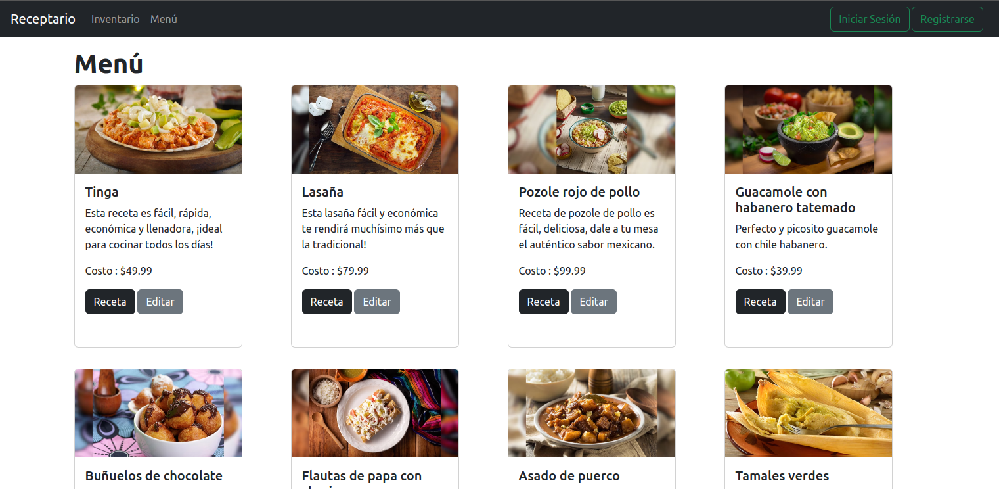
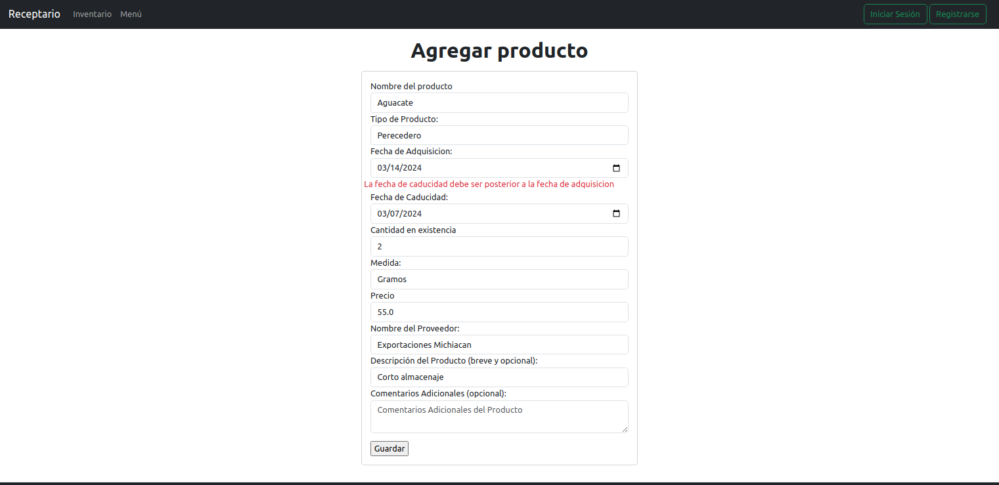
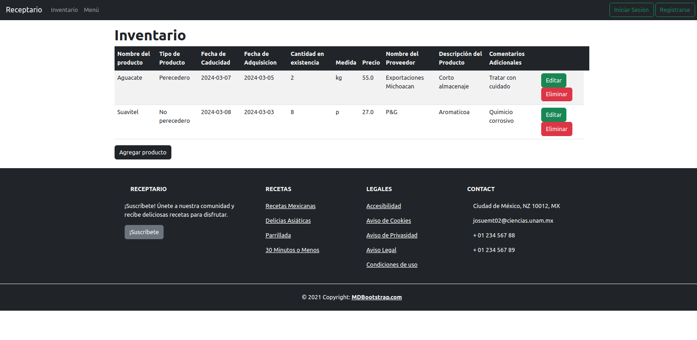
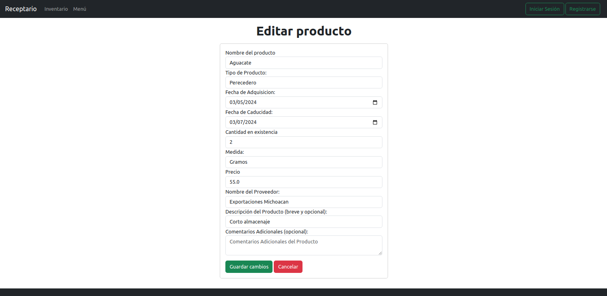

# Salads Menu Project


---
<p align="center">
  
</p>
<p align="center">Landing page</p>

<p align="center">
  
</p>
<p align="center">Form for ingredients with data backend checking</p>

<p align="center">
  
</p>
<p align="center">Dynamic inventary</p>

<p align="center">
  
</p>
<p align="center">Edition and deletion of inserted ingredients</p>

## Overview

The Salads Menu Project is a web application designed to showcase a variety of delicious salad options. This project aims to provide users with an easy-to-use interface to explore different salad recipes, ingredients, and nutritional information.

## Features

1. **Browse Salad Options**: Users can browse through a selection of diverse salad options.
2. **View Recipe Details**: Each salad option provides detailed information about its recipe, including ingredients, preparation steps, and nutritional facts.
2. **Ingredients stock**: Allows having a record of ingredients included their stock.

## Technologies Used

- **Frontend**:
  - HTML5
  - CSS3
  - Bootstrap (for styling)

- **Backend**:
  - Springboot framework for Java __(v17)__
  - PostgreSQL
  


## Technologies Used inside Spring Framework

1. **Spring Framework**: The core of the application is built using the Spring Framework.

2. **Spring Boot**: Often used to quickly bootstrap and set up Spring applications, Spring Boot simplifies the configuration and setup of Spring-based projects.

3. **Spring MVC (Model-View-Controller)**: Fundamental model-view-controller architecture tool.

4. **Spring Data JPA**: Used for high-level abstraction over JPA (Java Persistence API) allowing  developers to interact with the database using methods instead of queries.

10. **Thymeleaf**: Templating engine for server-side rendering.

10. **Lombok**: For java getters and setters shortcut.

11. **Hibernate**: Is used for object-relational mapping (ORM) and data persistence.

These are just some of the technologies commonly used in a Spring application. The actual technologies used may vary depending on the specific requirements and architecture of the application.


## Installation

To explore and utilize the capabilities of the Image Filtering Project, follow these installation instructions:

1. Download or clone this repository
2. Initialize database with:

```sh
docker compose -f ./docker-compose.yml up postgres
```
3. Once you assure it has started up:
  Starts up the springboot server

```sh
docker compose -f ./docker-compose.yml up spring-server
```
[!TIP] The server has changes autodetection, so autorestarts when modifications are made.
[!WARNING] Be carefull docker manually restart it when a major configuration file be 
made. Deleting all with:

```sh
docker compose -f ./docker-compose-db.yml down
```

## Usage
1. Access the application via your browser at 8080 port
  (http://localhost:8080).
- Browse through the list of salads available on the homepage.
- Click on a salad to view its recipe details.
- Manage ingredients on the inventary.
